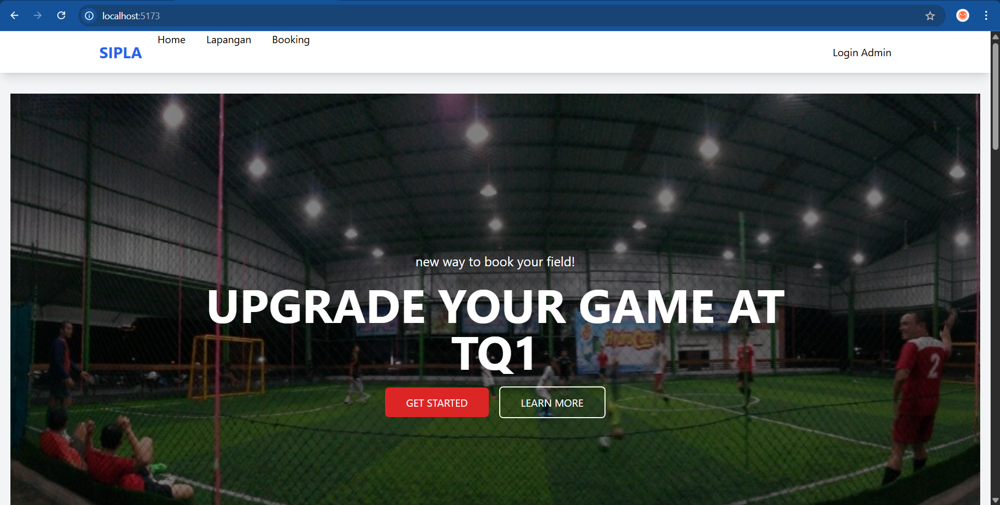
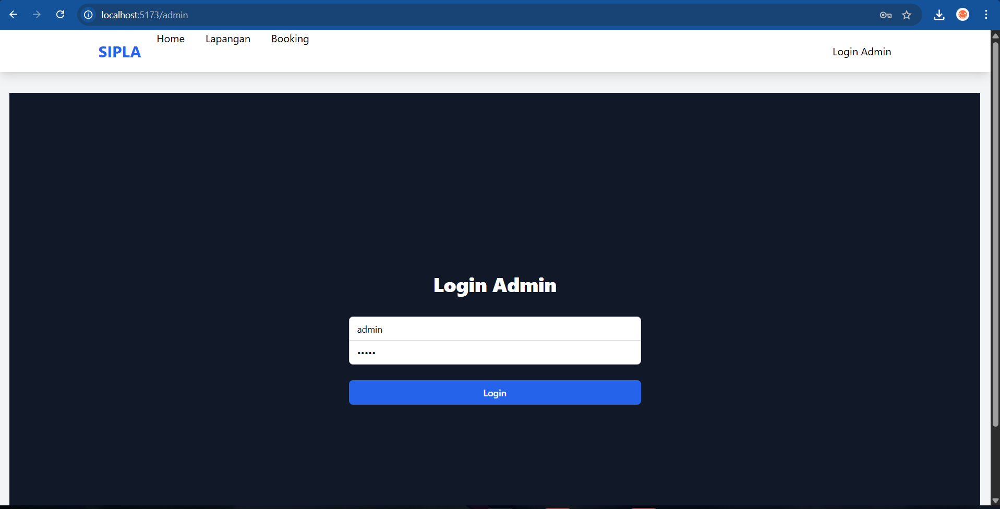
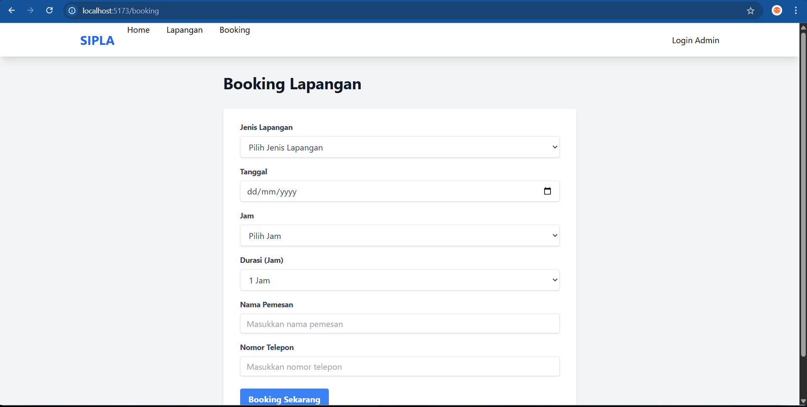
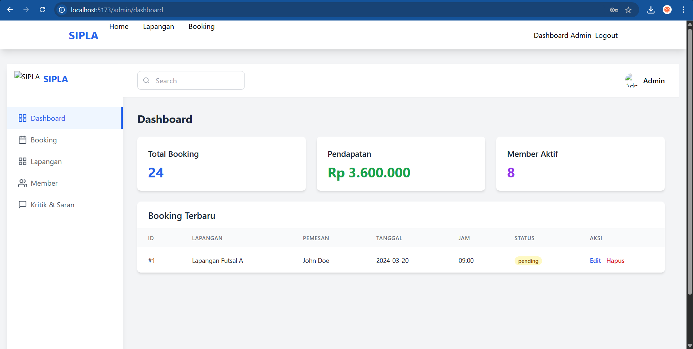
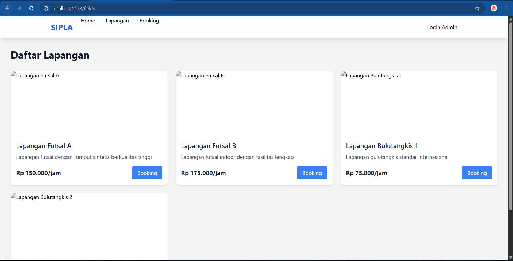

# Laporan Progres Mingguan - SIPLA
**Kelompok**: 4
**Anggota** : 
- Alsha Dwi Cahya 10231011
- Muhammad Aqila Ardhi 10231057
- Nanda Aulia Putri 10231067
- Norbertino Eurakha Nandatoti 101231071

**Mitra**: TQ1
**Pekan ke-**: [11]
**Tanggal**: [25/04/2025]

## Progress Summary
Pada progres minggu ini, Kelompok 4 telah melakukan beberapa pengembangan signifikan pada Website SIPLA:

1. Implementasi Fitur Autentikasi Admin:
   - Menambahkan sistem login khusus untuk admin menggunakan form input username dan password
   - Menggunakan JWT (JSON Web Token) untuk menyimpan token autentikasi di localStorage browser
   - Membuat middleware di backend untuk memverifikasi token JWT sebelum mengakses rute admin

2. Pengembangan UI dengan Tailwind CSS:
   - Landing Page: 
     * Hero section dengan background image opacity 50% dan teks di atasnya
     * Tombol "GET STARTED" dan "LEARN MORE" dengan hover effects
     * Tabel jadwal lapangan dengan header merah dan data per jam
   - Halaman Lapangan: Grid layout responsif untuk menampilkan foto dan detail lapangan
   - Form Booking: Form input dengan validasi required fields dan format data
   - Login Admin: Form login dengan input username/password dan error handling
   - Dashboard Admin: Sidebar fixed dengan menu navigasi dan area konten yang scrollable

3. Integrasi Frontend-Backend:
   - Endpoint API /api/auth untuk login dan verifikasi token
   - Context API React untuk menyimpan state autentikasi global
   - Axios untuk HTTP requests ke backend dengan interceptors untuk token

Pengembangan ini telah membuat website SIPLA lebih fungsional dengan sistem autentikasi yang aman dan UI yang responsif serta user-friendly.

## Accomplished Tasks
- Implementasi sistem autentikasi admin dengan JWT
- Pengembangan UI landing page dengan Tailwind CSS:
  - Hero section dengan background image dan tombol CTA
  - Tabel jadwal lapangan yang responsif
- Pembuatan halaman lapangan dengan grid layout
- Implementasi form booking dengan validasi input
- Desain halaman login admin yang modern
- Pengembangan dashboard admin dengan sidebar navigasi
- Integrasi awal frontend-backend:
  - Setup endpoint API untuk autentikasi
  - Implementasi state management
  - Konfigurasi komunikasi frontend-backend

## Challenges & Solutions
- **Challenge 1**: Implementasi sistem autentikasi admin yang aman dan efisien
  - **Solution**: Menggunakan JWT (JSON Web Token) untuk manajemen sesi dan mengimplementasikan middleware untuk memproteksi rute admin. JWT membantu menyimpan informasi login dengan aman dan efisien.

- **Challenge 2**: Mengintegrasikan Tailwind CSS dengan komponen React yang ada
  - **Solution**: Membuat utility classes yang reusable dan mengorganisir styling dengan pendekatan mobile-first. Memanfaatkan fitur-fitur Tailwind seperti responsive classes untuk UI yang konsisten.

- **Challenge 3**: Memastikan responsivitas UI di berbagai ukuran layar
  - **Solution**: Menggunakan fitur responsive design dari Tailwind CSS seperti breakpoints (sm, md, lg) dan flex/grid layouts untuk memastikan tampilan yang optimal di semua device.

- **Challenge 4**: Mengelola state autentikasi di seluruh aplikasi
  - **Solution**: Mengimplementasikan context API React untuk menyimpan dan mengelola state autentikasi secara global, sehingga memudahkan akses token dan status login di berbagai komponen.

## Next Week Plan
- Membuat fitur untuk beberapa core fitur.
- Membuat fitur login dan registrasi untuk pengguna.
- Memperbaiki tampilan UX pada Sistem SIPLA.
- Mengimplementasikan fitur inti dari SIPLA (sesuai kebutuhan mitra).

## Contributions
- **[Alsha Dwi Cahya]**: Membuat Penjelasan.
- **[Muhammad Aqila Ardhi]**: Demo progress ke mitra.
- **[Nanda Aulia Putri]**: Membuat Penjelasan.
- **[Norbertino Eurakha Nandatoti]**: Merancang Authentikasi, Mendesain website pada Sistem SIPLA, dan Membuat Laporan mingguan

## Screenshots / Demo

ini adalah beberapa Gambar/Screenshots dari Progres yang telah dilakukan pada minggu ini :
- Desain Halaman utama SIPLA

Halaman landing page dari sistem informasi penyewaan lapangan bernama SIPLA (Sistem Informasi Pemesanan Lapangan).

Berikut komponennya:
Fungsi Utama Halaman Ini
Halaman ini berfungsi sebagai pintu masuk utama pengguna ke dalam sistem SIPLA dan mengarahkan pengguna ke fitur utama seperti booking dan informasi lapangan.

-Komponen	Deskripsi-
Logo/Brand: SIPLA	
    Identitas sistem, diletakkan di kiri atas agar mudah dikenali.
Menu Navigasi: Home, Lapangan, Booking	Mengarahkan pengguna ke halaman informasi lapangan dan pemesanan.
Teks Promosi: UPGRADE YOUR GAME AT SIPLA	
    Menarik minat pengguna untuk memesan lapangan melalui sistem.
Subtext: new way to book your field!	
    Memberikan konteks bahwa sistem ini memberikan cara modern untuk booking.
Tombol Aksi: GET STARTED, LEARN MORE	
    Tombol untuk mengarahkan pengguna ke proses booking atau informasi detail.
User Info: Dashboard Admin, Logout	Menunjukkan bahwa user saat ini sedang dalam sesi admin/login.
Gambar Background	Menampilkan suasana lapangan untuk memperkuat konteks visual sistem.

- Halaman Admin login SIPLA

Halaman login untuk admin pada sistem SIPLA (Sistem Informasi Pemesanan Lapangan). 

Deskripsi Halaman Login Admin SIPLA

Komponen	Penjelasan
Judul Halaman: Login Admin	Menunjukkan bahwa halaman ini khusus untuk otorisasi pengguna dengan peran admin.
Input Username dan Password	Form untuk memasukkan kredensial login admin agar bisa mengakses fitur internal sistem.
Tombol Login untuk mengirimkan input form ke backend untuk proses autentikasi.
Tampilan Navigasi Atas	Terdapat menu Home, Lapangan, dan Booking untuk navigasi umum serta link Login Admin yang sedang aktif.
Desain UI	Tampilan clean dan fokus, dengan latar belakang gelap untuk membedakan area login dari tampilan utama.

Fungsi Halaman
Halaman ini memiliki peran penting sebagai pintu akses ke dashboard admin, di mana admin dapat:

Mengelola data lapangan

Melihat pemesanan

Melihat statistik atau laporan kritik saran 

Membuat akun status member

Hanya pengguna terautentikasi (admin) yang dapat mengakses fitur-fitur manajemen tersebut.

- Halaman form booking lapangan SIPLA

Halaman form booking lapangan pada sistem SIPLA (Sistem Informasi Pemesanan Lapangan).

Deskripsi Form Booking SIPLA

Komponen Form Booking:
1. Input Data Pemesan
   - Nama Lengkap: Field untuk mengisi identitas pemesan
   - Nomor Telepon: Kontak yang dapat dihubungi untuk konfirmasi
   - Email: Alamat email untuk pengiriman bukti booking

2. Detail Pemesanan
   - Pilihan Lapangan: Dropdown untuk memilih jenis lapangan (futsal/badminton)
   - Tanggal Main: Date picker untuk memilih tanggal booking
   - Jam Main: Time picker untuk memilih slot waktu bermain
   - Durasi: Pilihan lama waktu penyewaan (dalam jam)

3. Tombol Submit
   - Tombol "Book Now" untuk mengirimkan data pemesanan
   - Validasi form sebelum pengiriman data

Fungsi Halaman:
- Memfasilitasi proses pemesanan lapangan secara online
- Mengumpulkan informasi penting terkait booking
- Memastikan ketersediaan lapangan sesuai waktu yang dipilih
- Memberikan konfirmasi pemesanan kepada pengguna

Alur Pemesanan:
1. Pengguna mengisi form dengan data yang diperlukan
2. Sistem melakukan validasi input
3. Jika valid, data dikirim ke sistem untuk diproses
4. Pengguna menerima konfirmasi pemesanan
5. Admin dapat melihat pemesanan baru di dashboard

Desain UI form dibuat clean dan intuitif dengan field yang terorganisir rapi, menggunakan warna yang konsisten dengan tema SIPLA, serta memberikan feedback visual saat pengguna melakukan input atau terjadi error.

- Halaman dashboard SIPLA

Dashboard Admin dari sistem SIPLA (Sistem Informasi Pemesanan Lapangan).

Deskripsi Dashboard Admin SIPLA
Tujuan Halaman:
Halaman ini adalah pusat kontrol bagi admin, yang berfungsi untuk:

Memonitor data booking.

Melihat statistik pendapatan dan jumlah member aktif.

Mengelola data pemesanan, lapangan, member, serta kritik & saran.

Dashboard Admin SIPLA merupakan pusat kontrol bagi pengelola sistem untuk memantau dan mengelola aktivitas penyewaan lapangan. Pada bagian kiri halaman terdapat menu navigasi berupa sidebar yang terdiri dari beberapa fitur utama, yaitu Dashboard, Booking, Lapangan, Member, serta Kritik & Saran. Masing-masing menu ini mengarahkan admin ke fungsi manajemen data terkait.

Di bagian tengah tampilan dashboard, terdapat ringkasan statistik penting, seperti jumlah Total Booking yang menunjukkan banyaknya pemesanan yang telah dilakukan, kemudian Pendapatan yang menampilkan estimasi pemasukan dari total booking yang tercatat, serta Member Aktif yang menunjukkan jumlah pelanggan terdaftar sebagai member aktif di sistem.

Selain itu, sistem juga menampilkan Booking Terbaru dalam bentuk tabel yang mencakup informasi seperti ID pemesanan, nama lapangan yang dipesan, nama pemesan, tanggal dan jam penyewaan, status pemesanan (misalnya “pending”), serta dua aksi penting yaitu Edit dan Hapus untuk memudahkan admin dalam mengelola data yang masuk. Keseluruhan tampilan dashboard ini dirancang untuk memberikan kemudahan, kecepatan, dan efisiensi dalam pengelolaan operasional penyewaan lapangan.

- Halaman Lapangan SIPLA

Deskripsi Halaman Lapangan SIPLA
Tujuan Halaman:
Halaman ini adalah tempat untuk mengelola data lapangan yang tersedia. Pada halaman ini, admin dapat melihat daftar lapangan yang ada, menambahkan lapangan baru, mengedit informasi lapangan, dan menghapus lapangan yang tidak aktif.

