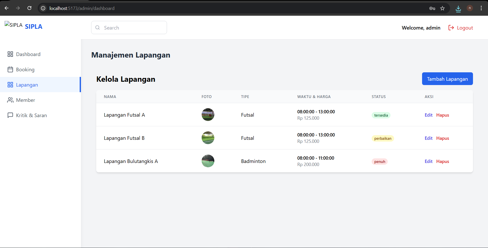
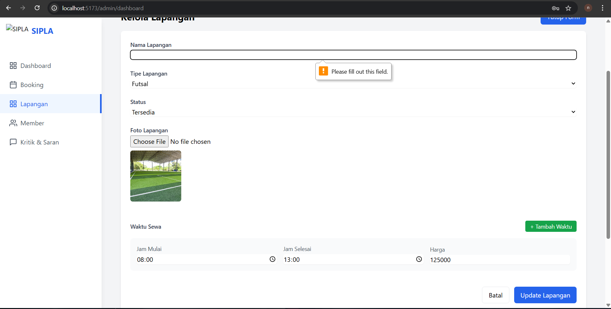
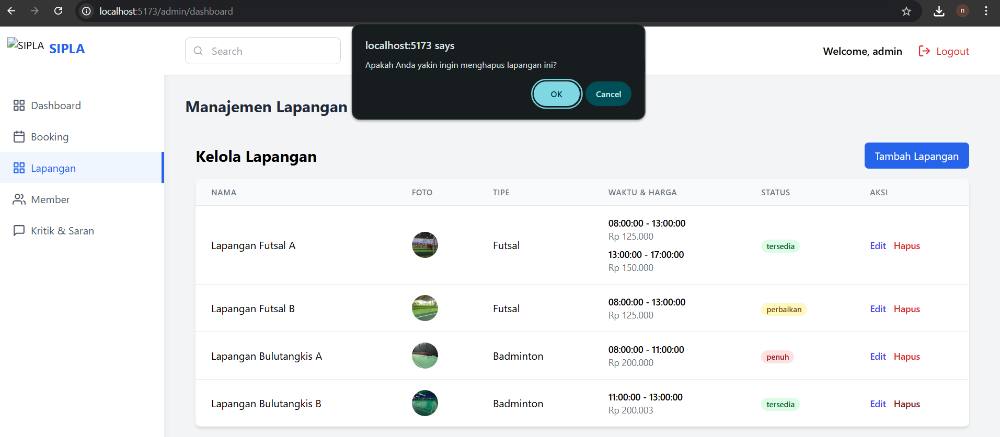
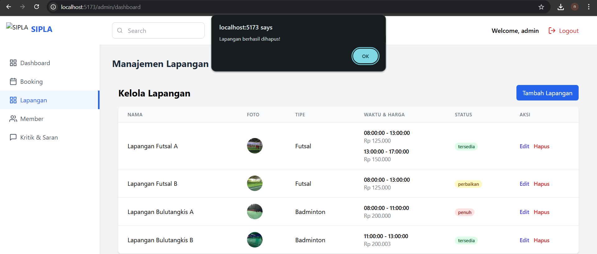
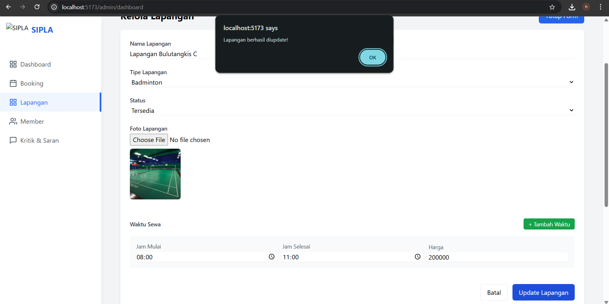
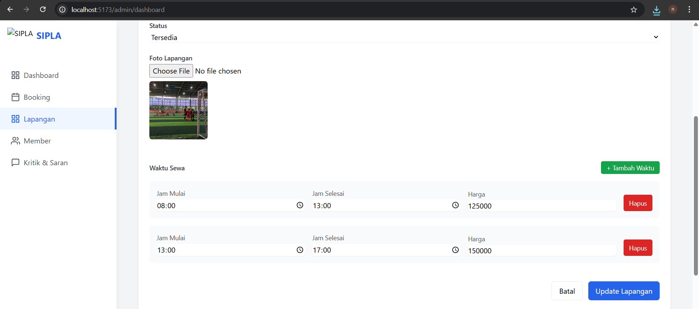

# Laporan Progres Mingguan - SIPLA
**Kelompok**: 4
**Anggota** : 
- Alsha Dwi Cahya 10231011
- Muhammad Aqila Ardhi 10231057
- Nanda Aulia Putri 10231067
- Norbertino Eurakha Nandatoti 101231071

**Mitra**: TQ1
**Pekan ke-**: [12]
**Tanggal**: [02/05/2025]

## Progress Summary
Pada progres minggu ini, Kelompok 4 telah melakukan beberapa pengembangan signifikan pada Website SIPLA:

1. Mengembangkan fitur pada halaman admin untuk menambahkan, menghapus, dan mengubah data lapangan yang tersedia untuk disewa. Fitur ini memungkinkan admin untuk mengatur data lapangan yang tersedia dan memudahkan pengguna dalam mencari lapangan yang sesuai dengan kebutuhannya. Misalnya, apabila admin ingin menambahkan lapangan badminton baru, maka admin dapat menambahkan data lapangan badminton baru pada halaman admin. Fitur ini terdiri dari tiga bagian, yaitu bagian untuk menambahkan data lapangan, bagian untuk menghapus data lapangan, dan bagian untuk mengubah data lapangan. Setelah admin menambahkan, menghapus, atau mengubah data lapangan, maka data tersebut akan disimpan dalam database dan dapat diakses oleh pengguna. Pada fitur ini, kami juga menambahkan beberapa case error handling jika form tidak di isi dengan benar.

2. Mengembangkan fitur pada halaman admin untuk menambahkan, menghapus, dan mengubah data jadwal jam sewa yang tersedia untuk disewa. Fitur ini memungkinkan admin untuk mengatur data jadwal jam sewa yang tersedia dan memudahkan pengguna dalam mencari jadwal jam sewa yang sesuai dengan kebutuhannya. Misalnya, apabila admin ingin menambahkan jadwal jam sewa lapangan badminton yang tersedia dari jam 8 pagi sampai 10 pagi, maka admin dapat menambahkan data jadwal jam sewa lapangan badminton yang tersedia dari jam 8 pagi sampai 10 pagi pada halaman admin. Fitur ini terdiri dari tiga bagian, yaitu bagian untuk menambahkan data jadwal jam sewa, bagian untuk menghapus data jadwal jam sewa, dan bagian untuk mengubah data jadwal jam sewa. Setelah admin menambahkan, menghapus, atau mengubah data jadwal jam sewa, maka data tersebut akan disimpan dalam database dan dapat diakses oleh pengguna. Pada fitur ini, kami juga menambahkan beberapa case error handling jika form tidak di isi dengan benar.

## Accomplished Tasks

- Implementasi fitur CRUD lapangan pada halaman admin untuk menambahkan, menghapus, dan mengubah data lapangan yang tersedia untuk disewa.
  - Fitur ini memungkinkan admin untuk mengatur data lapangan yang tersedia dan memudahkan pengguna dalam mencari lapangan yang sesuai dengan kebutuhannya.
- Implementasi fitur CRUD jadwal jam sewa pada halaman admin untuk menambahkan, menghapus, dan mengubah data jadwal jam sewa yang tersedia untuk disewa.
  - Fitur ini memungkinkan admin untuk mengatur data jadwal jam sewa yang tersedia dan memudahkan pengguna dalam mencari jadwal jam sewa yang sesuai dengan kebutuhannya.

## Challenges & Solutions

 **Challenge 1**: Implementasi fitur CRUD lapangan pada halaman admin untuk menambahkan, menghapus, dan mengubah data lapangan yang tersedia untuk disewa. Fitur ini memungkinkan admin untuk mengatur data lapangan yang tersedia dan memudahkan pengguna dalam mencari lapangan yang sesuai dengan kebutuhannya.
  - **Solution**:- Menggunakan API untuk menambahkan, menghapus, dan mengubah data lapangan yang tersedia untuk disewa dan menambahkan beberapa case error handling jika form tidak di isi dengan benar.

 **Challenge 2**: Implementasi fitur CRUD jadwal jam sewa pada halaman admin untuk menambahkan, menghapus, dan mengubah data jadwal jam sewa yang tersedia untuk disewa. Fitur ini memungkinkan admin untuk mengatur data jadwal jam sewa yang tersedia dan memudahkan pengguna dalam mencari jadwal jam sewa yang sesuai dengan kebutuhannya.
  - **Solution**: Menggunakan API untuk menambahkan, menghapus, dan mengubah data jadwal jam sewa yang tersedia untuk disewa dan menambahkan beberapa case error handling jika form tidak di isi dengan benar.

## Next Week Plan
- Membuat fitur untuk beberapa core fitur.
- Membuat fitur booking atau member bulutangkis.
- Memperbaiki tampilan UX pada Landing Page Sistem SIPLA.
- Mengimplementasikan fitur inti dari Sistem SIPLA (sesuai kebutuhan mitra).

## Contributions
- **[Alsha Dwi Cahya]**: Memberi detail penjelasan fitur dan test case
- **[Muhammad Aqila Ardhi]**: Test case & Demo
- **[Nanda Aulia Putri]**: Memberi detail penjelasan fitur dan test case
- **[Norbertino Eurakha Nandatoti]**: Merancang dan mengimplementasikan fitur CRUD untuk pengelolaan lapangan dan jadwal jam sewa, serta menyusun dokumentasi laporan progres mingguan

## Screenshots / Demo
Ini adalah beberapa Gambar/Screenshots dari Progres yang telah dilakukan pada minggu ini :

- Desain Halaman Manajemen Data Lapangan dan Jadwal Jam Sewa
Deskripsi penjelasan tiap fitur

1. Fitur CRUD Lapangan
    Fitur ini memungkinkan admin untuk:
    - Menampilkan daftar lapangan yang tersedia dalam sistem.
    - Menambah data lapangan baru.
    - Mengubah (edit) data lapangan seperti nama, tipe, waktu, harga, dan status.
    - Menghapus lapangan yang tidak digunakan.

    Masing-masing lapangan memiliki:
    - Foto → memberi konteks visual
    - Tipe (jenis olahraga)
    - Waktu & Harga 
    - Status (Hijau = tersedia), (Kuning = perbaikan), (Merah = penuh)
    - Tombol Edit & Hapus → aksi langsung ke data terkait

2. Fitur Jam Sewa Lapangan
    Fitur ini memungkinkan admin untuk:
    - Menentukan jam mulai dan jam selesai penyewaan lapangan.
    - Menetapkan harga sewa berdasarkan jam sewa yang diatur.
    - Menyimpan data jam dan harga sebagai bagian dari detail masing-masing lapangan.

    Setiap data jam sewa memiliki:
    - Jam Mulai & Jam Selesai → menentukan durasi penyewaan (contoh: 08:00 – 13:00).
    - Harga Sewa → ditentukan berdasarkan durasi, bisa disesuaikan dan diedit oleh admin.
    - Tampilan Tabel → jam dan harga yang sudah diatur akan muncul di tabel lapangan agar mudah dikelola dan dipantau.

    Fitur ini memungkinkan pelanggan untuk:
    - Melihat daftar jam sewa yang tersedia untuk setiap lapangan.
    - Memilih jam mulai dan jam selesai berdasarkan ketersediaan yang sudah ditentukan oleh admin.
    - Melihat harga sewa yang langsung menyesuaikan dengan jam yang dipilih.
    - Melakukan pemesanan hanya pada jam yang belum terisi (tidak bentrok dengan jadwal sebelumnya).

    User dapat melihat informasi secara real-time, seperti:
    - Jam yang sudah dipesan (tidak bisa dipilih),
    - Jam yang masih tersedia,
    - Estimasi total harga berdasarkan pilihan jam.

    

- Test Case 1: Form Manajemen Data Lapangan dan Jadwal Jam Sewa - Validasi Input Kosong
  
  Pada test case ini, sistem menguji validasi form ketika admin mencoba menambahkan lapangan baru tanpa mengisi nama lapangan yang merupakan field wajib. Sistem menampilkan pesan error yang memberitahu admin bahwa nama lapangan tidak boleh kosong, mencegah penyimpanan data yang tidak lengkap ke database. Validasi ini penting untuk memastikan integritas data dan konsistensi informasi lapangan dalam sistem.
  
    

- Test Case 2: Menghapus Data Lapangan dan Jadwal Jam Sewa
  
  Pada test case ini, sistem menguji fungsionalitas penghapusan data lapangan atau jadwal jam sewa dari database. Ketika admin memilih untuk menghapus sebuah item, sistem akan menampilkan dialog konfirmasi untuk memastikan tindakan tersebut disengaja, mencegah penghapusan data yang tidak diinginkan. Setelah konfirmasi, data akan dihapus secara permanen dari database dan tampilan akan diperbarui secara real-time untuk mencerminkan perubahan tersebut.
  
    
    

- Test Case 3: Mengubah Data Lapangan dan Jadwal Jam Sewa
  
  Pada test case ini, sistem menguji fungsionalitas pengubahan data lapangan yang sudah ada dalam database. Admin dapat memilih lapangan yang ingin diubah, kemudian sistem akan menampilkan form yang sudah terisi dengan data lapangan saat ini. Admin dapat mengubah informasi seperti nama, tipe, status, dan foto lapangan, lalu menyimpan perubahan tersebut. Sistem akan memvalidasi input yang dimasukkan dan memperbarui data di database serta tampilan secara real-time setelah perubahan berhasil disimpan.
  
    

- Test Case 4: Menambah Data Jadwal Jam Sewa
  
  Pada test case ini, sistem menguji fungsionalitas penambahan jadwal jam sewa baru untuk lapangan. Admin dapat menambahkan slot waktu baru dengan menentukan jam mulai, jam selesai, dan harga sewa untuk periode tersebut. Sistem secara otomatis memvalidasi bahwa jam mulai harus lebih awal dari jam selesai dan harga yang dimasukkan harus berupa angka positif. Fitur ini memungkinkan admin untuk mengatur ketersediaan lapangan dengan fleksibel sesuai dengan kebutuhan operasional tempat penyewaan.
  
    
