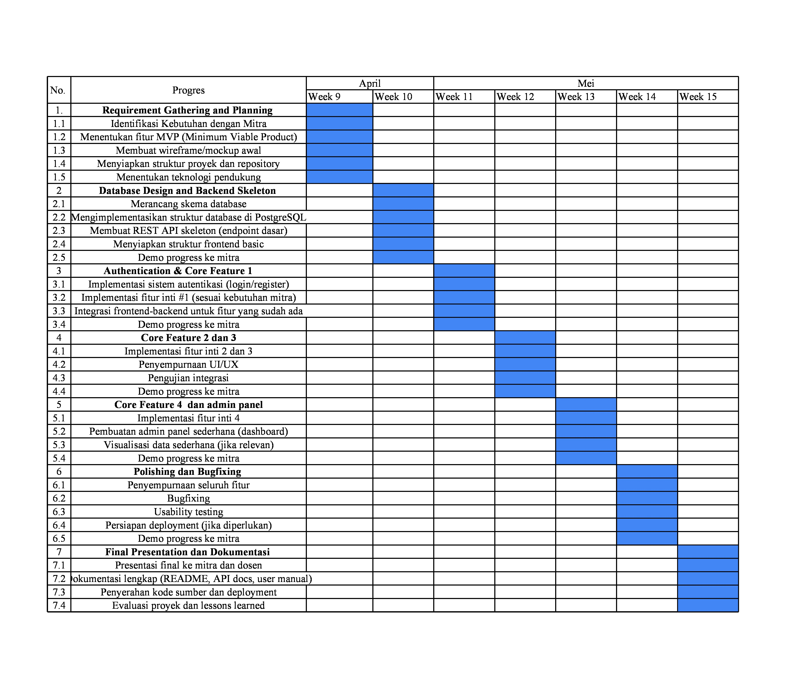
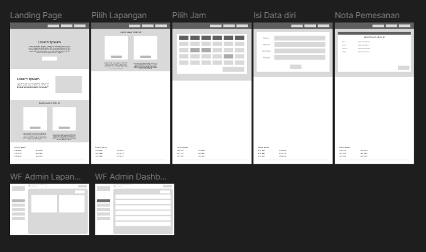

# Tugas 9 - [SIPLA]
**Nama**: Norbertino Eurakha Nandatoti
**NIM**: 10231071
**Kelompok**: A4
**Mitra**: TQ1
**Tanggal**: 14/04/2025

# Progress Summary

### 1. Deskripsi Kebutuhan Mitra 
TQ1 adalah tempat penyewaan lapangan futsal dan badminton yang berlokasi di Batu Ampar, Balikpapan Utara. Saat ini, proses pemesanan dan pencatatan masih dilakukan secara manual, baik untuk penyewaan reguler maupun event berdurasi maksimal dua hari. Pelanggan harus datang langsung atau menghubungi admin via WhatsApp untuk melakukan reservasi, dan status penyewaan dicatat menggunakan sistem warna.

Mitra mengalami kendala dalam pengelolaan jadwal dan transparansi ketersediaan lapangan, serta ketergantungan pada pencatatan manual yang berisiko terjadi kesalahan. Oleh karena itu, mitra membutuhkan sistem yang dapat membantu pelanggan melakukan pemesanan lapangan secara online, dengan tampilan jadwal slot waktu yang real-time dan sistem pencatatan otomatis. Meski pemesanan dilakukan melalui sistem, mitra tetap menginginkan konfirmasi dilakukan melalui WhatsApp.

Untuk pembayaran, mitra tidak menginginkan pembayaran online, melainkan tetap dilakukan di tempat, baik secara tunai maupun nontunai (misalnya melalui QRIS atau transfer). Sistem ini diharapkan dapat meningkatkan efisiensi operasional, mengurangi kesalahan pencatatan, memberikan kemudahan akses bagi pelanggan, serta mendukung pengelolaan penyewaan yang lebih rapi dan profesional.

---

### 2. Fitur-Fitur MVP (Minium Viable Product)
- Jadwal Real-Time
Pelanggan dapat melihat jadwal dan status ketersediaan lapangan secara langsung melalui sistem, dengan indikator warna untuk membedakan lapangan yang sudah terbooking dan masih tersedia.

- Pemesanan Online
Memudahkan pelanggan dalam melakukan booking harian maupun reservasi event secara fleksibel sesuai kebutuhan mereka.

- Notifikasi Pemesanan
Setelah melakukan pemesanan, pelanggan akan mendapatkan notifikasi otomatis melalui WhatsApp API sebagai konfirmasi transaksi.

- Statistik Pemesanan
Sistem menyediakan laporan pemesanan bulanan yang membantu mitra dalam menganalisis tren penggunaan lapangan dan mengoptimalkan strategi bisnis.

- Sistem Keanggotaan (Membership) 
Pelanggan dapat mendaftar sebagai anggota khusus untuk lapangan badminton dengan skema kunjungan dan keanggotaan berlangganan.

- Kritik dan Saran
Pelanggan dapat memberikan masukan terhadap layanan pemesanan lapangan melalui formulir yang tersedia di dalam sistem, sehingga mitra dapat terus meningkatkan kualitas layanan.

---

## 3. Timeline



Timeline pada gambar menggambarkan rencana pengembangan selama tujuh minggu, mulai dari Minggu ke-9 hingga Minggu ke-15. Timeline dibagi menjadi tujuh fase utama:

#### 1. Pengumpulan Kebutuhan & Perencanaan (Minggu 9):
Fokus pada identifikasi kebutuhan dengan mitra, penentuan fitur MVP (Minimum Viable Product), pembuatan wireframe atau mockup awal, penyiapan struktur proyek serta repository, dan penentuan teknologi pendukung yang akan digunakan dalam pengembangan sistem.

#### 2. Desain Database & Kerangka Backend (Minggu 10):
Meliputi perancangan skema database, implementasi struktur database menggunakan PostgreSQL, pembuatan REST API skeleton (endpoint dasar), serta penyiapan struktur awal frontend.

#### 3. Autentikasi & Fitur Utama #1 (Minggu 11):
Pengembangan sistem autentikasi (login dan register), implementasi fitur inti pertama sesuai kebutuhan mitra, dan integrasi antara frontend dan backend untuk fitur yang sudah dibuat.

#### 4. Fitur Utama #2 & #3 (Minggu 12):
Melanjutkan implementasi fitur inti kedua dan ketiga, penyempurnaan antarmuka pengguna (UI/UX), serta pengujian integrasi sistem secara keseluruhan.

#### 5. Fitur Utama #4 & Panel Admin (Minggu 13):
Implementasi fitur inti keempat, pembuatan panel admin sederhana (seperti dashboard), serta penambahan visualisasi data jika dibutuhkan untuk memperkaya informasi yang disajikan.

#### 6. Penyempurnaan & Perbaikan Bug (Minggu 14):
Penyempurnaan dan penggabungan seluruh fitur, proses bug fixing untuk mengatasi error, usability testing untuk memastikan sistem mudah digunakan, dan persiapan deployment jika diperlukan.

#### 7. Presentasi Final & Dokumentasi (Minggu 15):
Tahap akhir berupa presentasi final ke mitra dan dosen, penyusunan dokumentasi lengkap (README, API docs, user manual), penyerahan kode sumber dan hasil deployment, serta evaluasi keseluruhan proyek dan pembelajaran yang didapatkan.

---

## 4. Struktur Folder

```
sistem-peminjaman-lapangan/
├── app/
│   ├── Http/
│   │   ├── Controllers/
│   │   │   ├── Admin/
│   │   │   │   ├── BookingController.php
│   │   │   │   ├── FieldController.php
│   │   │   │   ├── MemberController.php
│   │   │   │   ├── DashboardController.php
│   │   │   │   ├── ReportController.php
│   │   │   │   └── StatisticController.php
│   │   │   ├── User/
│   │   │   │   ├── BookingController.php
│   │   │   │   ├── ProfileController.php
│   │   │   │   └── FeedbackController.php
│   │   │   ├── Auth/
│   │   │   │   ├── LoginController.php
│   │   │   │   └── RegisterController.php
│   │   │   └── HomeController.php
│   │   ├── Middleware/
│   │   │   ├── AdminMiddleware.php
│   │   │   └── MemberMiddleware.php
│   │   └── Requests/
│   │       ├── BookingRequest.php
│   │       ├── FieldRequest.php
│   │       └── FeedbackRequest.php
│   │
│   ├── Models/
│   │   ├── User.php
│   │   ├── Booking.php
│   │   ├── Field.php
│   │   ├── FieldDetail.php
│   │   ├── Member.php
│   │   └── Feedback.php
│   │
│   └── Services/
│       ├── BookingService.php
│       └── ReportService.php
│
├── database/
│   ├── migrations/
│   │   ├── create_users_table.php
│   │   ├── create_fields_table.php
│   │   ├── create_field_details_table.php
│   │   ├── create_bookings_table.php
│   │   ├── create_members_table.php
│   │   └── create_feedbacks_table.php
│   └── seeders/
│       ├── UserSeeder.php
│       └── FieldSeeder.php
│
├── resources/
│   ├── views/
│   │   ├── admin/
│   │   │   ├── dashboard/
│   │   │   ├── booking/
│   │   │   ├── field/
│   │   │   ├── member/
│   │   │   ├── report/
│   │   │   └── statistic/
│   │   ├── user/
│   │   │   ├── booking/
│   │   │   ├── profile/
│   │   │   └── feedback/
│   │   ├── auth/
│   │   │   ├── login.blade.php
│   │   │   └── register.blade.php
│   │   ├── layouts/
│   │   │   ├── admin.blade.php
│   │   │   ├── user.blade.php
│   │   │   └── app.blade.php
│   │   └── landing.blade.php
│   │
│   ├── js/
│   │   ├── app.js
│   │   └── booking.js
│   │
│   └── css/
│       └── app.css
│
├── public/
│   ├── images/
│   ├── css/
│   └── js/
│
├── routes/
│   ├── web.php
│   └── api.php
│
└── config/
    └── booking.php
```

Penjelasan struktur folder:
1. **`app/Http/Controllers/`:**
- Folder `Admin/`: Controller untuk fungsi admin
- Folder `User/`: Controller untuk fungsi user
- Folder `Auth/`: Controller untuk autentikasi

2. **`app/Models/`:**
- Berisi model-model yang diperlukan sistem
- Setiap entitas memiliki model tersendiri

3. **`app/Services/`:**
- Berisi logika bisnis yang kompleks
- Memisahkan logika dari controller

4. **`database/migrations/`:**
- Berisi file migrasi untuk membuat struktur database
- Setiap tabel memiliki file migrasi tersendiri

5. **`resources/views/`:**
- Folder `admin/`: View untuk halaman admin
- Folder `user/`: View untuk halaman user
- Folder `auth/`: View untuk halaman autentikasi
- Folder `layouts/`: Template layout

6. **`public/`:**
- Menyimpan asset publik seperti gambar, CSS, dan JavaScript

7. **`routes/`:**
- `web.php`: Route untuk web interface
- `api.php`: Route untuk API (jika diperlukan)

## 5. Mockup



Wireframe ini menggambarkan alur pemesanan lapangan secara online, dimulai dari halaman Landing Page yang berfungsi sebagai titik awal bagi pengguna. Halaman ini menampilkan informasi umum mengenai layanan, fitur unggulan, dan tombol ajakan untuk memulai proses pemesanan. Tujuannya adalah menarik perhatian pengunjung dan mengarahkan mereka ke tahap berikutnya dengan navigasi yang jelas dan tampilan yang menarik.

Setelah itu, pengguna diarahkan ke halaman Pilih Lapangan, di mana mereka dapat memilih lapangan yang ingin disewa. Halaman ini menyajikan daftar lapangan beserta deskripsi singkat atau informasi pendukung lainnya agar pengguna bisa menentukan pilihan sesuai kebutuhan. Ini membantu mempercepat proses pencarian dan seleksi lapangan yang tersedia.

Tahap selanjutnya adalah halaman Pilih Jam, yang memungkinkan pengguna untuk memilih waktu penyewaan lapangan. Waktu yang tersedia ditampilkan dalam bentuk grid atau tabel, sehingga pengguna dapat melihat slot mana yang masih kosong dan melakukan pemesanan sesuai dengan jadwal mereka. Fungsi ini sangat penting untuk memastikan ketersediaan waktu yang diinginkan.

Setelah memilih waktu, pengguna diarahkan ke halaman Isi Data Diri, tempat mereka mengisi informasi pribadi seperti nama, nomor telepon, kategori pengguna, dan keterangan tambahan jika diperlukan. Data ini digunakan untuk keperluan administrasi dan pencatatan pemesanan, serta untuk keperluan konfirmasi dan komunikasi dengan pengguna.

Sebagai langkah akhir dari proses pemesanan, halaman Nota Pemesanan menampilkan ringkasan dari seluruh informasi yang telah dimasukkan pengguna, termasuk detail lapangan, waktu, dan data pribadi. Pengguna dapat meninjau kembali pesanan mereka sebelum melakukan konfirmasi akhir. Halaman ini juga berfungsi sebagai bukti atau referensi transaksi yang dapat dicetak atau disimpan.

Di sisi pengelolaan, terdapat dua halaman tambahan untuk admin. Halaman WF Admin Lapangan berfungsi untuk mengatur data lapangan, memungkinkan admin menambah, mengubah, atau menghapus informasi lapangan yang tersedia untuk disewa. Sedangkan halaman WF Admin Dashboard merupakan pusat kendali bagi admin untuk memantau aktivitas pemesanan, melihat daftar transaksi, dan mengelola data pengguna. Kedua halaman ini sangat penting untuk menjaga kelancaran operasional sistem dan memberikan kontrol penuh kepada pengelola.

# Accomplised Task

- Membuat struktur folder aplikasi
- Membuat beberapa tampilan WireFrame untuk fitur utama
- Menyusun Timeline pengerjaan