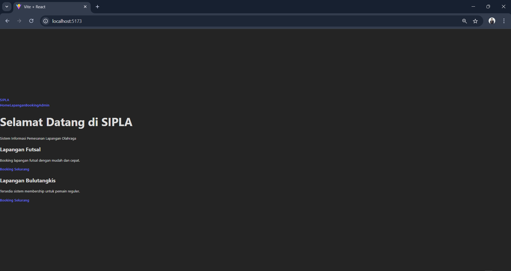
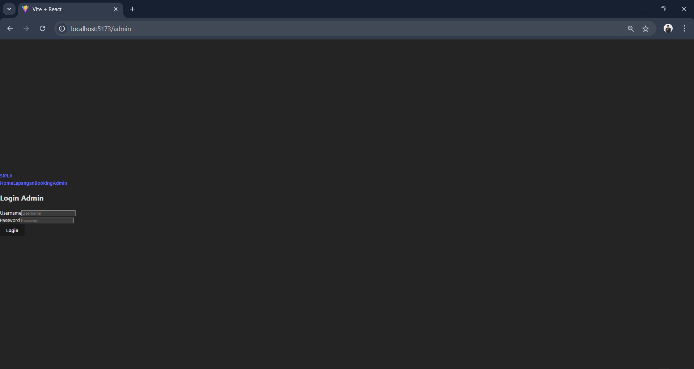
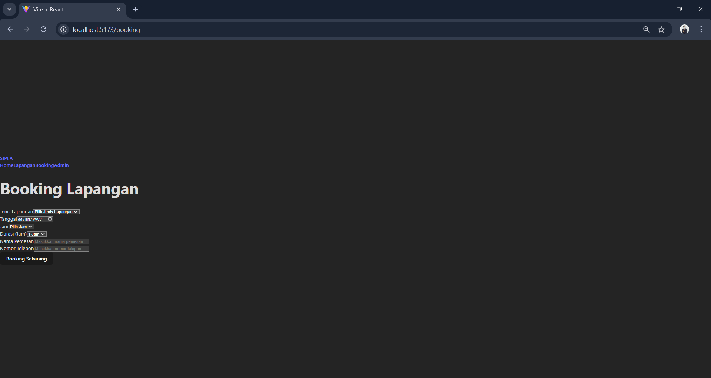
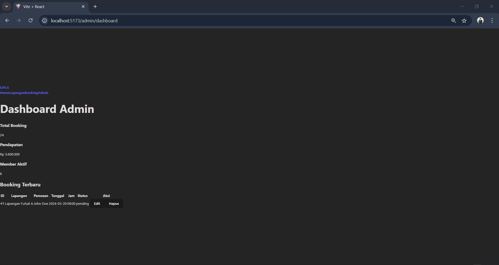
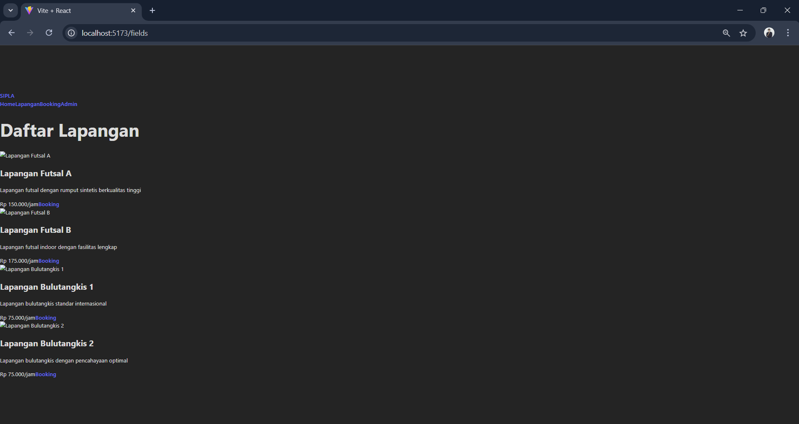
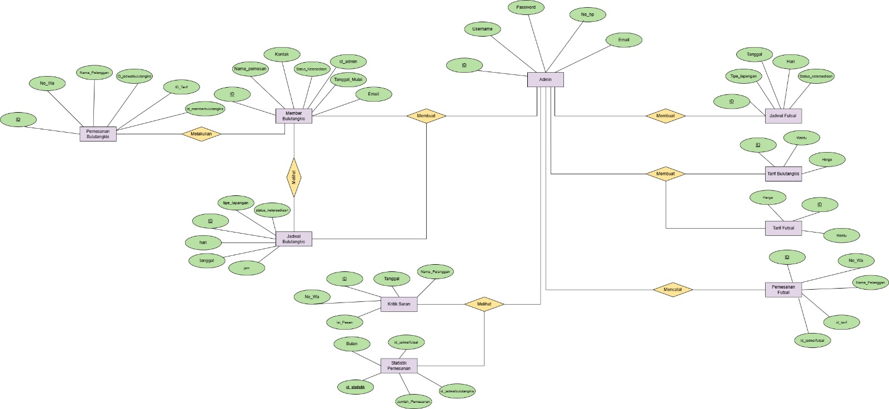

# Laporan Progres Mingguan - SIPLA
**Kelompok**: 4
**Anggota** : 
- Alsha Dwi Cahya 10231011
- Muhammad Aqila Ardhi 10231057
- Nanda Aulia Putri 10231067
- Norbertino Eurakha Nandatoti 101231071

**Mitra**: TQ1
**Pekan ke-**: [10]
**Tanggal**: [18/04/2025]

## Progress Summary
Pada Progres yang telah dilakukan diminggu ini, Kelompok 7 telah membangun pondasi dasar pada Website SIPLA, yang dimana kami membuat beberapa endpoints API untuk mengakses data dari database walau belum mengimplementasikan nya dengan database. Kami juga telah membuat beberapa halaman web yang dapat di akses oleh pengguna. Berikut adalah beberapa hal yang telah kami lakukan pada minggu ini-

## Accomplished Tasks
- Membuat beberapa endpoint API untuk mengakses data dari database.
- Membuat beberapa halaman web yang dapat di akses oleh pengguna.
- Membuat desain ERD untuk database SIPLA.

## Challenges & Solutions
- **Challenge 1**: Membuat endpoint API yang dapat mengakses data dari database dengan benar.
  - **Solution**: Kami menggunakan framework API yang sesuai untuk membuat endpoint API yang dapat mengakses data dari database dengan benar.
- **Challenge 2**: Membuat halaman web yang dapat di akses oleh pengguna dengan mudah.
  - **Solution**: Kami menggunakan framework web yang sesuai untuk membuat halaman web yang dapat di akses oleh pengguna dengan mudah.

## Next Week Plan
- Mengimplementasikan endpoint API dengan database.
- Membuat fitur login dan registrasi untuk pengguna.
- Mengimplementasikan fitur inti dari SIPLA (sesuai kebutuhan mitra).

## Contributions
- **[Alsha Dwi Cahya]**: Membuat ERD untuk database SIPLA.
- **[Muhammad Aqila Ardhi]**: Memperbaiki Class Diagram untuk SIPLA.
- **[Nanda Aulia Putri]**: Membuat ERD untuk database SIPLA.
- **[Norbertino Eurakha Nandatoti]**: Merancang Endpoint API dan Halaman Web SIPLA dan Menyusun Dokumen Laporan Progres Mingguan.

## Screenshots / Demo

ini adalah beberapa Gambar/Screenshots dari Progres yang telah dilakukan pada minggu ini :
- Halaman utama SIPLA

- Halaman Admin login SIPLA

- Halaman form booking lapangan SIPLA

- Halaman dashboard SIPLA

- Halaman Lapangan SIPLA

- ERD SIPLA
