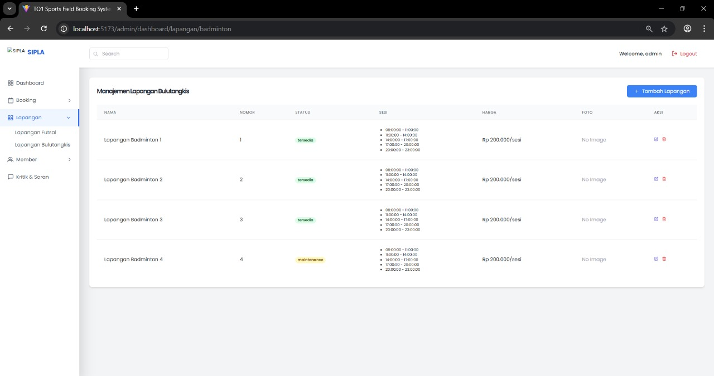
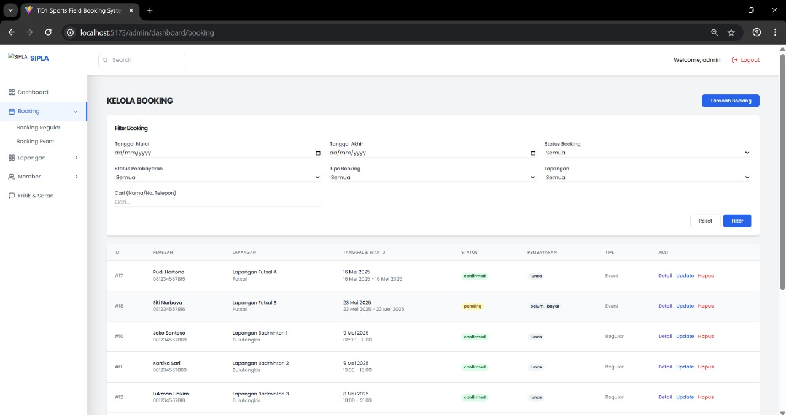
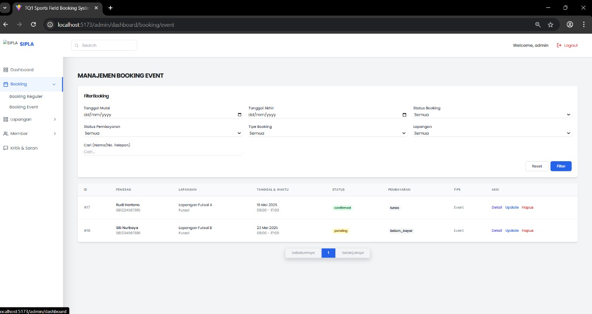
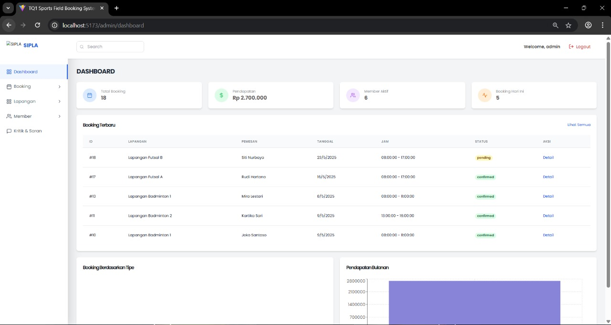
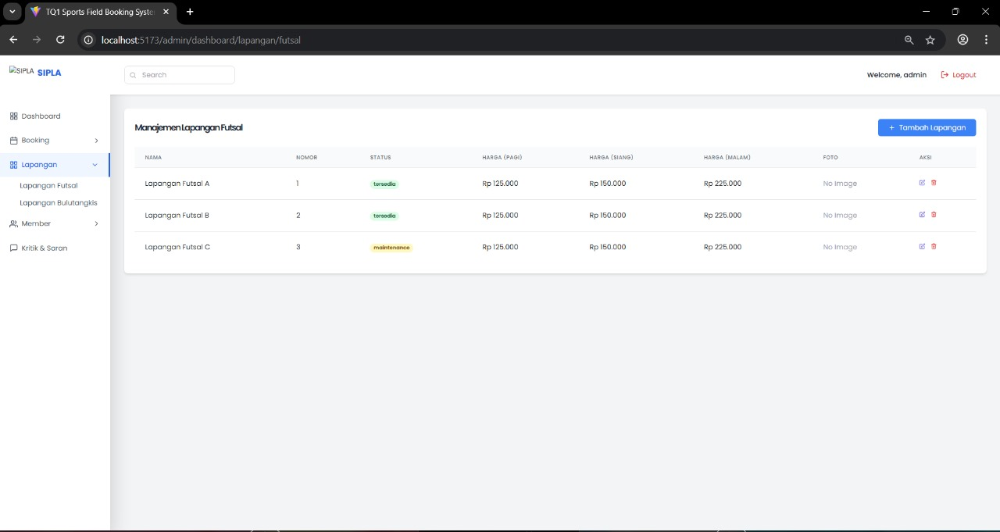

# Laporan Progres Mingguan - SIPLA
**Kelompok**: 4
**Anggota** : 
- Alsha Dwi Cahya 10231011
- Muhammad Aqila Ardhi 10231057
- Nanda Aulia Putri 10231067
- Norbertino Eurakha Nandatoti 101231071

**Mitra**: TQ1
**Pekan ke-**: [13]
**Tanggal**: [09/05/2025]

## Progress Summary
Pada progres minggu ini, Kelompok 4 telah melakukan beberapa pengembangan signifikan pada Website SIPLA:
1. Implementasi Statistik Pembookingan di Dashboard
    - Penambahan tampilan total booking, total pendapatan, jumlah member aktif, dan jumlah booking hari ini.

    - Penambahan daftar booking terbaru yang menampilkan detail lapangan, pemesan, tanggal, dan status.

    - Visualisasi grafik pendapatan bulanan untuk memantau performa keuangan.

2. Manajemen Data Lapangan Futsal & Bulutangkis (Terpisah)
    Pemisahan halaman antara Lapangan Futsal dan Lapangan Bulutangkis di menu sidebar.

    - Masing-masing halaman menampilkan:
        - Daftar lapangan (nama, nomor, status)
        - Harga berbeda untuk pagi/siang/malam (khusus futsal)
        - CRUD tambah/edit/hapus lapangan
        - Indikator status seperti tersedia dan maintenance

3. Manajemen Data Booking Reguler & Event
    Penambahan dua jenis booking: Booking Reguler dan Booking Event, masing-masing dengan halaman khusus.

    - Tampilan tabel booking yang memuat:
        - Nama pemesan, tanggal & jam main, status booking, status pembayaran, dan tipe booking.
        - Aksi: Detail, Update, Hapus.
        - Memungkinkan filter berdasarkan tanggal, tipe, status booking, dan status pembayaran.

4. Penggunaan Data Dummy
    - Data booking dummy telah ditambahkan untuk keperluan pengujian tampilan dan fungsionalitas.

    - Variasi status booking (confirmed, pending) dan pembayaran (lunas, belum bayar) digunakan untuk simulasi real-case scenario.

## Accomplished Tasks

- Implementasi fitur Statistik Pembookingan di halaman dashboard admin.
  - Fitur ini memungkinkan admin untuk memantau performa sistem secara menyeluruh melalui data total booking, total pendapatan, jumlah member aktif, dan jumlah booking hari ini. Selain itu, daftar booking terbaru dan grafik pendapatan bulanan memudahkan admin dalam mengambil keputusan berbasis data.
- Pemisahan data lapangan berdasarkan jenis olahraga (Futsal dan Bulutangkis).
  - Fitur ini memungkinkan admin untuk mengelola lapangan secara lebih terstruktur dengan memisahkan daftar lapangan berdasarkan jenisnya. Hal ini memudahkan dalam pencatatan harga, status ketersediaan, dan jadwal penggunaan sesuai kebutuhan masing-masing olahraga.
- Pemisahan dan pengelolaan booking reguler dan booking event.
  - Fitur ini memungkinkan admin untuk membedakan pemesanan reguler (sesi harian) dengan event (kegiatan khusus), sehingga penjadwalan tidak saling bertabrakan. Setiap tipe booking juga memiliki halaman tersendiri yang membuat pengelolaan data lebih rapi.
- Implementasi fitur CRUD (Create, Read, Update, Delete) untuk data lapangan.
  - Fitur ini memungkinkan admin untuk menambahkan lapangan baru, memperbarui informasi, menghapus data yang tidak berlaku, serta melihat detail masing-masing lapangan. 

## Challenges & Solutions

**Challenge 1**: Pemisahan data lapangan berdasarkan jenis olahraga (Futsal dan Bulutangkis) agar lebih terstruktur dan memudahkan admin dalam pengelolaan data.
  - **Solution**:-  Membuat dua halaman terpisah pada menu admin untuk masing-masing jenis lapangan, dan menghubungkannya dengan database melalui endpoint API yang berbeda. Implementasi fitur CRUD dilakukan secara modular untuk tiap jenis lapangan.

**Challenge 2**: Menyediakan sistem statistik pembookingan yang informatif dan real-time di halaman dashboard admin.
  - **Solution**: Mengintegrasikan logika backend yang menghitung total booking, pendapatan, member aktif, dan booking hari ini. Data kemudian ditampilkan di frontend menggunakan komponen visual dan chart dinamis.

**Challenge 3**: Mengelola data booking yang terdiri dari dua tipe berbeda (Reguler dan Event) dalam satu sistem agar tidak membingungkan pengguna.
  - **Solution**: Membuat dua subhalaman khusus untuk Booking Reguler dan Booking Event, serta menyediakan fitur filter berdasarkan tanggal, status booking, dan status pembayaran.

**Challenge 4**: Pengujian sistem tanpa data nyata yang cukup, sehingga membutuhkan data representatif untuk demonstrasi dan debugging.
  - **Solution**: Menambahkan data dummy dengan variasi status (confirmed, pending) dan status pembayaran (lunas, belum bayar) untuk memverifikasi tampilan dan logika sistem pada berbagai kondisi.

## Contributions
- **[Alsha Dwi Cahya]**: Menyusun dokumentasi laporan progres mingguan dan memberi detail penjelasan
- **[Muhammad Aqila Ardhi]**: Demo ke mitra
- **[Nanda Aulia Putri]**: Memberi detail penjelasan fitur 
- **[Norbertino Eurakha Nandatoti]**: Merancang dan mengimplementasikan fitur tambahan

## Screenshots / Demo
Ini adalah beberapa Gambar/Screenshots dari Progres yang telah dilakukan pada minggu ini :

1. Manajemen Lapangan Bulutangkis

    - Fitur ini memungkinkan admin untuk:
        - Menampilkan daftar lapangan bulutangkis yang tersedia dalam sistem.
        - Menambah data lapangan baru dengan informasi nama, nomor, sesi, dan harga.
        - Mengubah (edit) data lapangan seperti status, harga per sesi, serta jadwal sesi.
        - Menghapus lapangan yang tidak aktif atau tidak digunakan.

    - Masing-masing lapangan memiliki:
        - Nama & Nomor → untuk membedakan tiap unit lapangan.
        - Status → menunjukkan apakah lapangan tersedia (hijau) atau sedang maintenance (kuning).
        - Jadwal Sesi → menampilkan waktu-waktu yang bisa dipesan oleh pelanggan.
        - Harga per sesi → tarif untuk setiap kali penggunaan lapangan.
        - Foto → memberikan identifikasi visual lapangan (belum tersedia, ditampilkan sebagai “No Image”).
        - Tombol Edit & Hapus → memungkinkan admin melakukan aksi langsung pada masing-masing data.

2. Kelola Booking

    - Fitur ini memungkinkan admin untuk:
        - Menampilkan seluruh data pemesanan lapangan dari pelanggan.
        - Menambah data booking baru secara manual.
        - Melakukan filter data berdasarkan tanggal, status, jenis booking, dan nama lapangan.
        - Mengubah status booking dan pembayaran secara langsung.
        - Menghapus atau memperbarui data booking sesuai kebutuhan.

    - Masing-masing data booking mencakup:
        - ID Booking dan Informasi Pemesan → nama dan nomor telepon pelanggan.
        - Nama Lapangan & Jenis Olahraga → sesuai dengan yang dipesan.
        - Tanggal & Waktu Booking → termasuk sesi waktu yang dipilih.
        - Status Booking:
            - Confirmed (hijau)
            - Pending (kuning)
        - Status Pembayaran:
            - Lunas
            - Belum Bayar
    - Tipe Booking → bisa berupa Event atau Reguler.
    - Tombol Aksi:
        - Detail: untuk melihat info lengkap.
        - Update: untuk mengubah status booking/pembayaran.
        - Hapus: untuk menghapus data pemesanan.

3. Manajemen Booking Event

    - Fitur ini memungkinkan admin untuk:
        - Menampilkan dan mengelola data pemesanan lapangan khusus untuk acara atau event.
        - Menambahkan booking event secara manual.
        - Memfilter data berdasarkan tanggal, status, nama lapangan, dan jenis booking.
        - Memperbarui status booking dan pembayaran pelanggan.
        - Melihat detail informasi booking atau menghapus data jika diperlukan.

    - Masing-masing data booking event mencakup:
        - ID Booking dan Pemesan → nama pelanggan dan nomor telepon.
        - Nama Lapangan & Jenis Olahraga → lapangan yang dipesan untuk event.
        - Tanggal & Waktu → durasi event secara penuh (contoh: 08:00 – 17:00).
        - Status Booking:
            - Confirmed (hijau)
            - Pending (kuning)
        - Status Pembayaran:
            - Lunas
            - Belum Bayar
    - Tipe Booking: ditandai sebagai Event
    - Tombol Aksi:
       - Detail → lihat info lengkap.
       - Update → ubah status atau data pemesanan.
       - Hapus → menghapus data event jika dibatalkan.

4. Fitur Dashboard Admin

    - Fitur ini memungkinkan admin untuk:
        - Melihat ringkasan aktivitas sistem seperti total booking, total pendapatan, jumlah member aktif, dan jumlah booking hari ini.
        - Menampilkan daftar booking terbaru secara real-time.
        - Melihat grafik pendapatan bulanan dan rekap booking berdasarkan tipe.

    - Masing-masing elemen pada dashboard mencakup:
        - Statistik Utama (Kartu Ringkasan):
            - Total Booking → jumlah keseluruhan pemesanan yang masuk.
            - Pendapatan → total pemasukan dari semua transaksi booking.
            - Member Aktif → jumlah akun pengguna/member yang aktif melakukan booking.
            - Booking Hari Ini → jumlah booking yang dilakukan pada hari ini.
        - Booking Terbaru:
            - ID Booking dan Pemesan → nomor pemesanan dan nama pelanggan.
            - Nama Lapangan & Tanggal → lapangan yang dipesan dan tanggal main.
            - Jam → waktu penggunaan lapangan.
        - Status Booking:
            - Confirmed (hijau)
            - Pending (kuning)
        - Aksi:
            - Detail → untuk melihat informasi lengkap pemesanan.
        - Visualisasi Data:
            - Pendapatan Bulanan → grafik batang yang menampilkan jumlah pemasukan per bulan.
            - Booking Berdasarkan Tipe → diagram yang menunjukkan jumlah booking berdasarkan jenis (misal: reguler/event).

5. Fitur Manajemen Lapangan Futsal

    - Fitur ini memungkinkan admin untuk:
        - Melihat daftar lapangan futsal yang tersedia dalam sistem.
        - Mengatur status lapangan (tersedia atau maintenance).
        - Melihat dan mengatur harga lapangan berdasarkan waktu (pagi, siang, malam).
        - Menambahkan, mengedit, dan menghapus data lapangan.

    - Masing-masing elemen pada halaman ini mencakup:

        - Daftar Lapangan:
            - Nama → nama dari masing-masing lapangan (misalnya Lapangan Futsal A, B, C).
            - Nomor → identifikasi atau urutan dari lapangan tersebut.
        - Status:
            - Tersedia (warna hijau) → lapangan bisa digunakan untuk booking.
            - Maintenance (warna kuning) → lapangan sedang tidak tersedia untuk booking.
        - Harga:
            - Pagi → tarif pemakaian pada jam pagi.
            - Siang → tarif pemakaian pada jam siang.
            - Malam → tarif pemakaian pada jam malam.
        - Foto → belum tersedia atau belum diunggah (tertulis No Image).
        - Aksi:
            - Edit (ikon pensil) → untuk mengubah informasi lapangan.
            - Hapus (ikon tempat sampah) → untuk menghapus data lapangan.
        - Tombol Tambah Lapangan:
            - Tombol “+ Tambah Lapangan” di kanan atas digunakan untuk menambahkan data lapangan baru ke dalam sistem.

